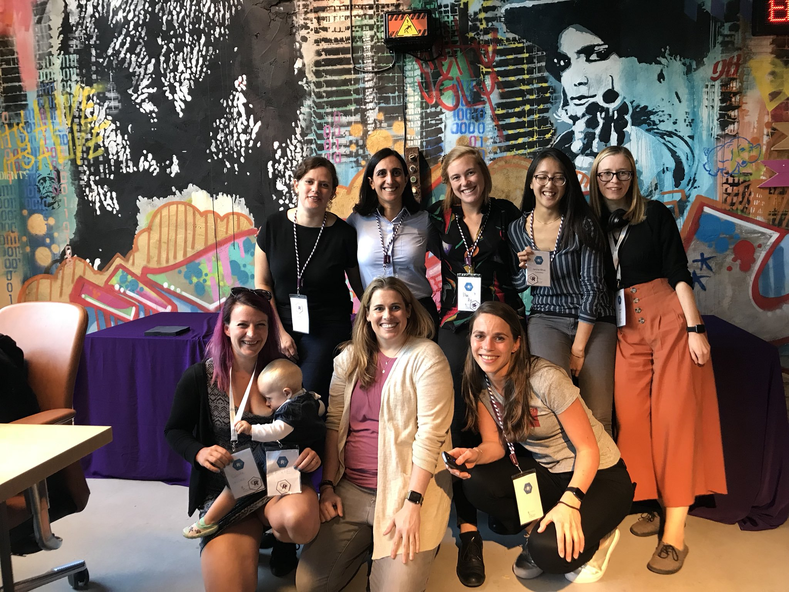

## Mise à jour 2022 


Come back to my native langage ! `r emoji::emoji("france")`

Au passage quelqu'un sait pourquoi :smile: m'affiche pas le smiley même dans 
le `.md` direct ? `r emoji::emoji("smirk")`

Du coup je suis obligée d'utiliser :  ` emoji::emoji("france")` Et c'est long ! 
`r emoji::emoji("sweat_smile")`

Hé oui, parce que je suis française et 
beaucoup plus à l'aise pour m'exprimer dans cette langue pour un blog personnel.

Et de toute façon y a déjà bien assez de R-blogs très bons en anglais,
j'apporterais rien de plus. 

J'ai aussi un gros trauma qui pique par rapport à l'anglais...

Donc je vire carrément l'ancienne version de cette section anglaise, 
aaaaah ça fait du bien. `r emoji::emoji("sweat_smile")` 

Et `r emoji::emoji("sweat_smile")`  c'est mon emoji préféré alors habitue toi. 
Ah oui c'est pas parce que 
j'ai switché en français que je vais pas utiliser des anglissismes ou te tutoyer, 
mon français blogué est un français oral, cherche pas les négations 
(NE cherche pas, voilà, très bon exemple, habitue toi aussi `r emoji::emoji("sweat_smile")` ).


En faisant ce blog je me sens vraiment comme un serial knitter, 
je knitte à répétition, un ajout, un knit `r emoji::emoji("sweat_smile")` 

'#blaguedemerde '#grossemalignelehashtagcestuntitreenmarkdown

## A propos de ce blog

A la demande générale de 3 personnes sur Twitter(quand j'y allais encore
en 2018)... Voici mon blog !

## Pourquoi ce blog ?

Pour la reproductibilité !

Pour partager avec la communauté des utilisateurs de R, mais aussi pour moi,
pour organiser ce que je fais et avoir une chance de retrouver ce que j'ai déjà 
programmé mais dont j'ai oublié comment...

## Qu'y a t-il dedans ? 

Des trucs de data science avec R. J'aime tester des packages, essayer ce que je
découvre lors de conférences ou tutoriels. Peut-être que ça peut intéresser q
uelqu'un, donc je vous le partage. 

## A propos de moi


~~Je vous laisse regarder mon [CV](/cv.pdf) si vous louvez plus de détails, 
mais pour le moment je vais commencer une nouvelle aventure en travaillant 
pour Kapa IT en mission pour Royal Canin comme R&D data scientist. 
Un nouveau défi très excitant !~~

Compte rendu de ces 4 mois dans l'équipe Disruptive Innovation :
(que des hommes blancs)... ils m'ont fait croire juqu'au dernier jour de préavis 
que j'allais être prolongée... Pour m'appeler une fois rentrée chez moi et me
dire que finalement non... Donc 1h30 de route le lendemain (aller-retour) 
juste pour ramener l'ordi du boulot Grrrrr

Heureusement j'avais codé par mal de trucs pour une super équipe de chercheuses 
qui ont réussi à me reprendre (en interim) pendant 2 mois...

Après j'ai brievement été à mon compte le temps de donner une formation 
Tidyverse pour l'URFIST de Bordeaux. J'ai adoré, c'était super intéressant et 
j'ai aussi eu de bons retours.

Puis j'ai été assistante maternelle, oui y a pas de data je sais, mais on parfois 
on est obligées de s'adapter dans la vie. 

Enfin, les data me manquent, me revoilà !


J'ai une merveilleuse petite fille. 
~~Elle a 15 mois et est déjà allée à 2 conférences sur R.~~
Elle a maintenant (2022) 5 ans et est toujours aussi merveilleuse <3 

Je vais passer en visible le chunk suivant qui refuse de m'afficher l'image, 
alors que ça fonctionnait avec l'ancien blogdown d'y a 4 ans...


```{r, echo=TRUE, fig.cap="Avec d'autres R-ladies à SatRdays Amsterdam 2018 (Je suis celle avec les cheveux rose et un bébé pendu au sein )", out.width = '100%'}

```


et en profiter pour la redimensionner avec imagemagick pour l'insérer direct 
dans le markdown (qui envoie les images taille d'origine), comme pour je ne sais quelle raison, ça marchait avec l'ancien blogdown
mais que visiblement ça marche plus maintenant.

```{r}
library(magick)

image_read("img/aboutme1.jpg") %>%
  image_scale("1200x")
```

Avec d'autres R-ladies à SatRdays Amsterdam 2018 (Je suis celle avec les cheveux rose et un bébé pendu au sein). 

Merci la légende j'aurais galéré à retrouver d'où venait cette photo. 

J'en mettrais bien une plus récente mais flemme. 
